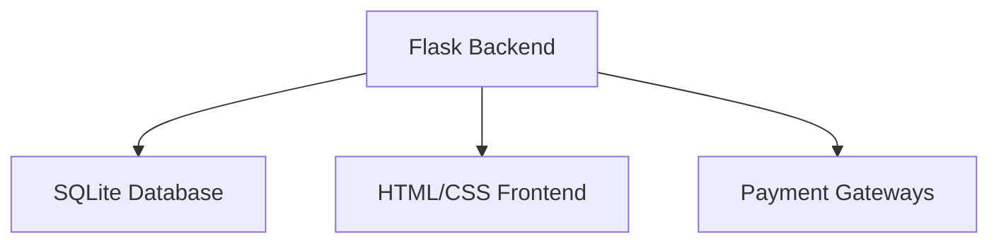
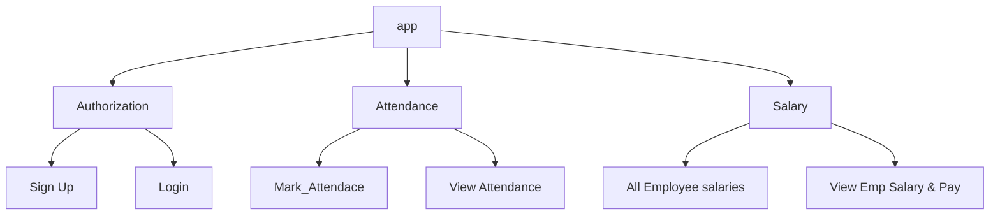
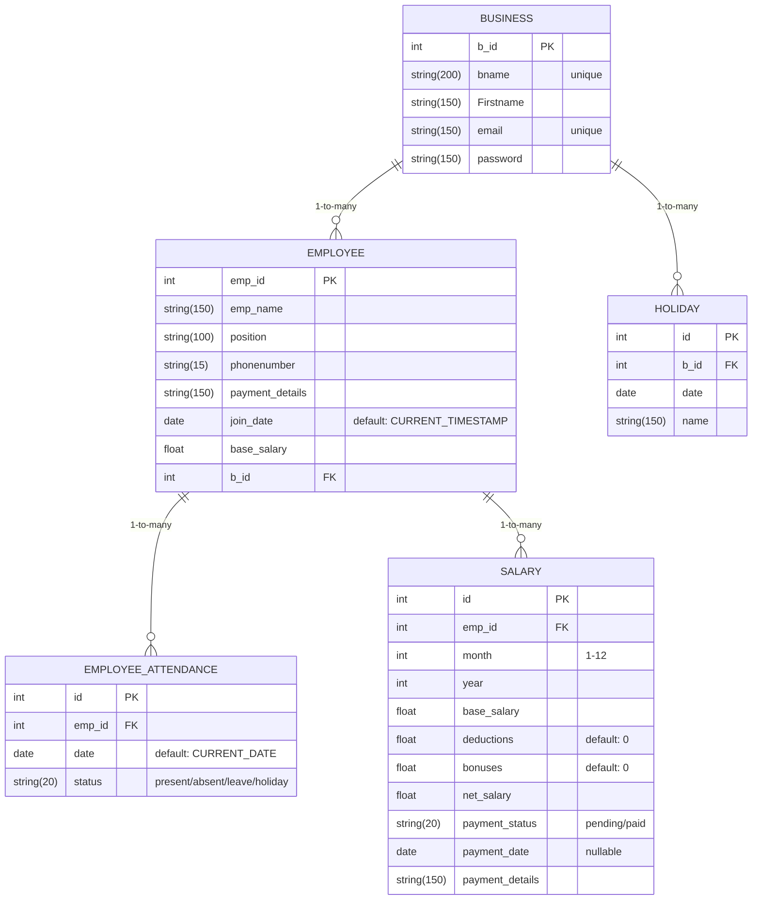

# Powerstep - [Flask-app](https://powerstep-emse-flask-app.onrender.com)
### Employee Management System

*A Flask-based web app for small businesses to track attendance and automate payroll*

## 📌 Project Overview (Situation)

Small businesses often struggle with **manual attendance tracking** and **error-prone salary calculations**. This project addresses those pain points by providing:
- ✅ Digital attendance recording (Present/Absent/Leave/Holiday)
- ✅ Automated salary computation
- ✅ WhatsApp report sharing
- ✅ Payment integration capabilities

## 🛠 Technical Implementation (Task & Action)

### System Architecture


### Idea of implementating Design


## Hierarchy of this Project
``` 
**EMPLOYEE_MANAGEMENT**/
├── **instance**/
├── **website**/
│   ├── static/
│   └── templates/
│   |    ├── base.html
│   |    ├── home.html
│   |    ├── login.html
│   |    ├── mark_attendance.html
│   |    ├── salaries.html
│   |    ├── sign_up.html
│   |    ├── view_attendance.html
│   |    └── view_salary.html
|   ├── __init__.py
|   ├── auth.py
|   ├── models2.py
|   ├── salarylogic.py
|   └── views.py
├── main.py
├── Procfile
└── requirements.txt

```
 `main.py` is the file to execute
 
---------------------------------------------------------------------

## Py Files & their purpose

| File | Purpose | Key Responsibilities |
|------|---------|----------------------|
| [`main.py`](main.py) | Application entry point | Initializes Flask app, runs development server |
| [`__init__.py`](__init__.py) | Application factory | <ul><li>Database configuration</li><li>Blueprint registration</li><li>Auth system setup</li></ul> |
| [`auth.py`](auth.py) | Authentication system | <ul><li>User registration</li><li>Login/logout functionality</li><li>Session management</li></ul> |
| [`views.py`](views.py) | Business logic | <ul><li>Employee CRUD operations</li><li>Attendance tracking</li><li>Salary reports</li></ul> |
| [`models2.py`](models2.py) | Database schema | <ul><li>Table definitions</li><li>Relationships (1:M, M:1)</li><li>Data constraints</li></ul> |
| [`salarylogic.py`](salarylogic.py) | Payroll processor | <ul><li>Daily wage calculation</li><li>Deductions/bonuses</li><li>Payment status tracking</li></ul> |

--------------------------------------------------------------------------------

##### Database scheme representation

The `new_database.db` file includes five tables—**Business, Employee, Employee_Attendance, Holiday, and Salary**—which are defined using SQLAlchemy models in the `models2.py` file




## Highlights of the Project
#### Technical Highlights
- Flask-based MVC architecture
- SQLAlchemy ORM for database operations
- Blueprint-based routing
- Jinja2 templating for dynamic HTML
- WTForms for secure form handling

#### Other key features.
- You can monitor everything from anywhere using an internet connection.
- As a business owner, it helps you save time and reduce manual effort.
- The system is scalable and reliable, suitable for growing businesses.
- Your data is backed up and accessible online whenever you need it.
- Employee salaries are calculated and paid automatically based on their attendance.

#### Future advancements
- The system can be developed into a mobile app for easier access.
- Attendance reports can be shared directly via WhatsApp.
- Attendance tracking can be upgraded with biometric or face recognition technology.

## Setup Instruction

1. Clone repository
   ```bash
   git clone https://github.com/Saikiran-Erukonda/Powerstep-EMSE-Flask-app.git
   ```
2. Install dependencies
    ```bash
   pip install -r requirements.txt
   ```

3. Run application
   ```bash
   python main.py
   ``` 
> Click to explore working of the Website link [PowerStep -EMSE ](https://powerstep-emse-flask-app.onrender.com)

-----------------------
## Author 
### Erukonda Saikiran | Data Analyst | Hyderabad.
Follow me on [GitHub](https://github.com/Saikiran-Erukonda/) for upcoming projects

> My Linkedin profile : [Saikiran-Erukonda](https://www.linkedin.com/in/saikiran-erukonda-4379911a3/)

