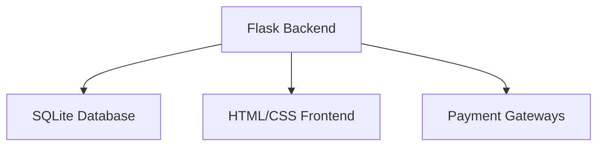
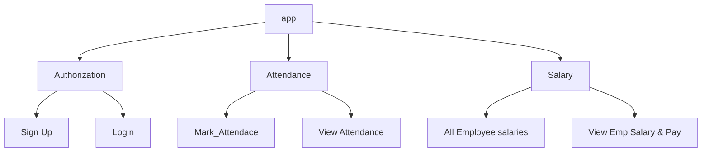

# Powerstep - Flask-app
### Employee Management System

*A Flask-based web app for small businesses to track attendance and automate payroll*

### Hierarchy of this Project
``` 
**EMPLOYEE_MANAGEMENT**/
├── **instance**/
├── **website**/
│   ├── static/
│   └── templates/
│   |    ├── base.html
│   |    ├── home.html
│   |    ├── login.html
│   |    ├── mark_attendance.html
│   |    ├── salaries.html
│   |    ├── sign_up.html
│   |    ├── view_attendance.html
│   |    └── view_salary.html
|   ├── __init__.py
|   ├── auth.py
|   ├── models2.py
|   ├── salarylogic.py
|   └── views.py
├── main.py
├── Procfile
└── requirements.txt
```
 `main.py` is the file to execute


## 📌 Project Overview (Situation)

Small businesses often struggle with **manual attendance tracking** and **error-prone salary calculations**. This project addresses those pain points by providing:
- ✅ Digital attendance recording (Present/Absent/Leave/Holiday)
- ✅ Automated salary computation
- ✅ WhatsApp report sharing
- ✅ Payment integration capabilities

## 🛠 Technical Implementation (Task & Action)

### System Architecture


Idea of implementating Design



